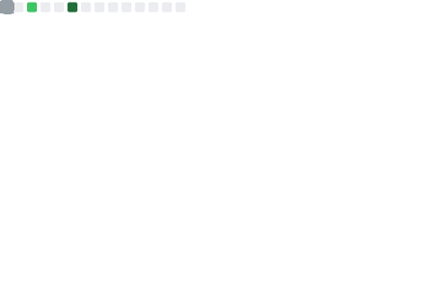
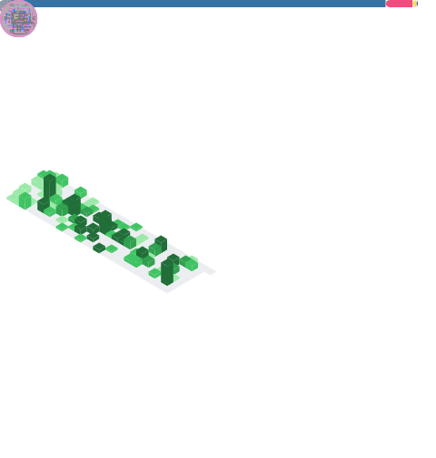

<h1 align="center"> Меня зовут Николай Петухов 👋! </h1>
<h3 align="center"> 
  Я Backend разработчик с опытом работы на таких языках программирования как: SAP ABAP, Python, Scala, C++ и SQL, а также у меня имеется опыт разработки Frontend части: JavaScript, CSS, HTML.
</h3>

## Skills

<!-- 

   

   
-->

## Tools

   

   

<!--
## Contacts

 

-->

  
  &emsp;
  

